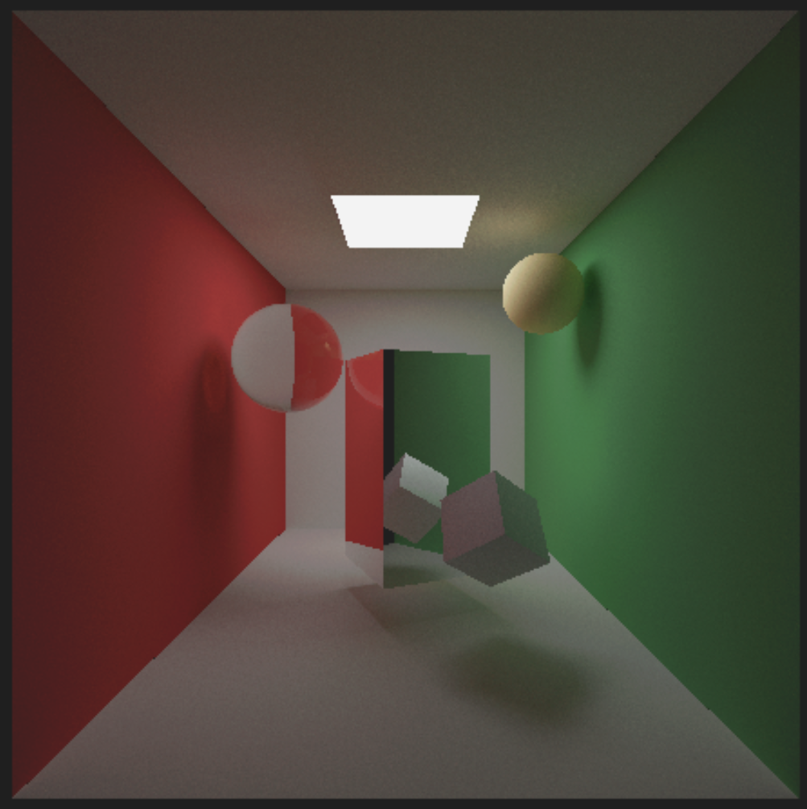
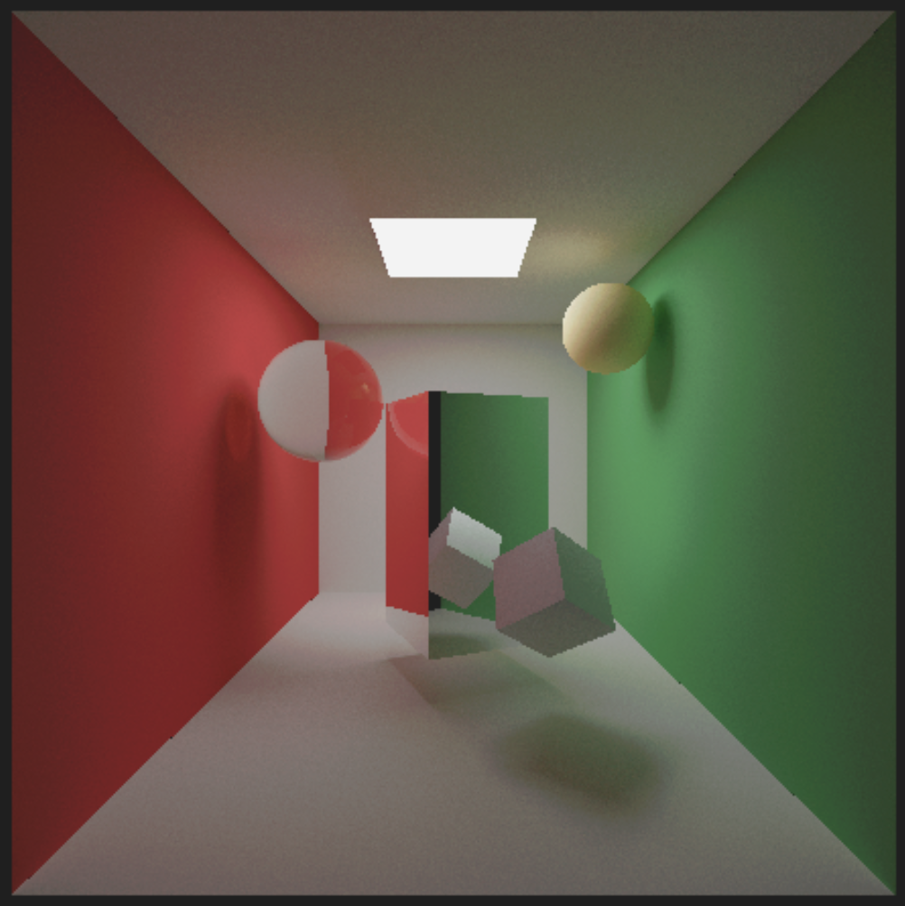
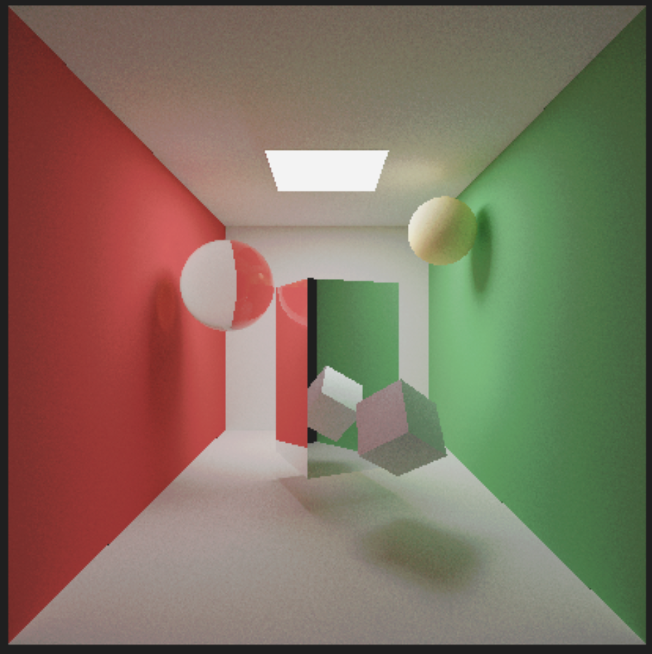
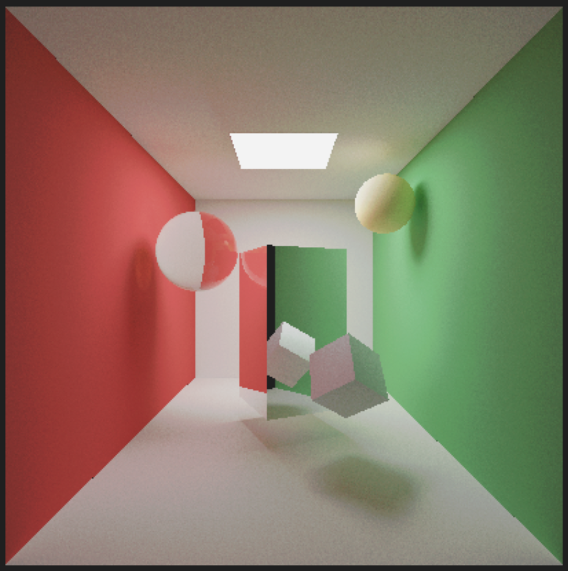

# 基于WebGL的路径追踪渲染器

## 项目简介

这是一个基于WebGL的路径追踪渲染器，是计算机图形学课程的大作业。该项目由个人独立完成，实现了在浏览器中运行的真实感图形渲染，能够生成照片级别的渲染图像。

## 渲染器效果

| 采样帧数 | 光照强度 |                         渲染效果图片                         |
| :------: | :------: | :----------------------------------------------------------: |
| 1000 帧  |    20    |  |
| 1000 帧  |    40    |  |
|  1000帧  |    80    |  |
| 1000 帧  |   100    |  |


## 技术栈

- **前端框架**: React + TypeScript
- **渲染引擎**: Three.js + WebGL
- **样式框架**: Tailwind CSS
- **构建工具**: Vite
- **着色器语言**: GLSL

## 核心特性

### 🎨 真实感渲染
- 完整的路径追踪算法实现
- 基于物理的全局光照模拟
- 软阴影、颜色溢出、环境遮蔽等高级光照效果
- 支持漫反射和镜面反射材质

### ⚡ 性能优化
- 使用WebGL片元着色器进行GPU并行计算
- 渐进式渲染策略，实时显示渲染进度
- 下一事件估计(NEE)加速收敛
- 俄罗斯轮盘赌终止递归

### 🎮 交互体验
- 实时相机控制(OrbitControls)
- 动态参数调整
- 收敛过程可视化

## 项目结构

```
src/
├── components/
│   └── PathTracer/
│       ├── index.tsx          # 主组件
│       ├── Canvas.tsx         # WebGL画布管理
│       ├── Controls.tsx       # 交互控制面板
│       ├── Header.tsx         # 页面头部
│       ├── PathTracingShader.glsl.ts  # 路径追踪着色器
│       └── ScreenShader.glsl.ts       # 屏幕后处理着色器
├── App.tsx                    # 应用入口
├── main.tsx                   # 主程序入口
└── index.css                  # 全局样式
```

## 技术实现

### 路径追踪算法
项目实现了基于蒙特卡洛积分的路径追踪算法，通过求解渲染方程来模拟真实的光线传播：

$$
L_o(p, \omega_o) = L_e(p, \omega_o) + \int_{\Omega} f_r(p, \omega_i, \omega_o) L_i(p, \omega_i) (\omega_i \cdot n) d\omega_i
$$


### 渐进式渲染
采用乒乓缓冲区技术实现渐进式渲染：
- 每帧生成新的样本
- 与历史帧累积混合
- 随着帧数增加，噪声以 $1/\sqrt{N}$ 的速度降低

### 场景定义
实现了经典的Cornell Box场景，包含：
- 红色左墙、绿色右墙
- 天花板面光源
- 漫反射和镜面反射物体

## 安装与运行

### 环境要求
- Node.js 16+
- 现代浏览器（支持WebGL 2.0）

### 安装依赖
```bash
npm install
```

### 开发模式
```bash
npm run dev
```

### 构建项目
```bash
npm run build
```

### 预览构建
```bash
npm run preview
```

## 渲染效果

随着采样帧数增加，图像质量逐步提升：
- **1帧**: 直接光照和阴影基本清晰
- **10帧**: 噪点明显减少，颜色溢出开始显现
- **100帧**: 图像基本平滑，高频噪声几乎消失
- **1000帧**: 接近照片级质量

## 学习收获

通过这个项目，深入理解了：
- 计算机图形学的渲染管线
- 物理基础渲染(PBR)原理
- GPU并行编程思想
- WebGL和GLSL编程
- 蒙特卡洛方法在图形学中的应用

## 未来改进方向

- 添加BVH加速结构支持复杂场景
- 实现更多材质类型（折射、次表面散射）
- 引入降噪算法提升低采样数质量
- 添加景深和运动模糊效果

## 作者信息

- **类型**: 本科生计算机图形学课程作业
- **完成方式**: 个人独立完成
- **完成时间**: 2025年11月

